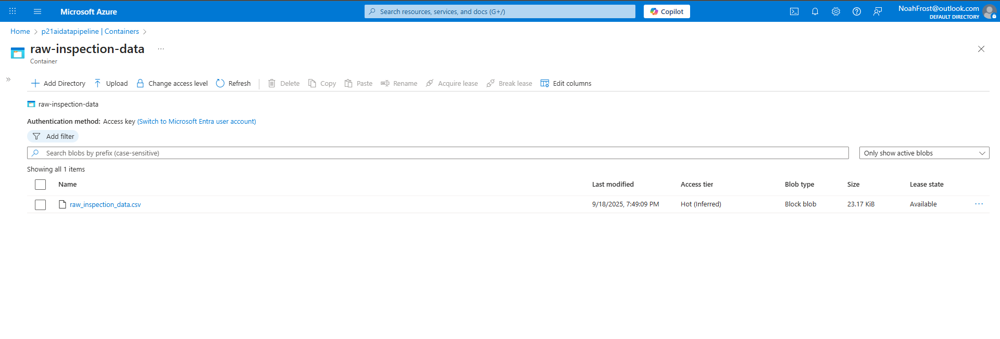
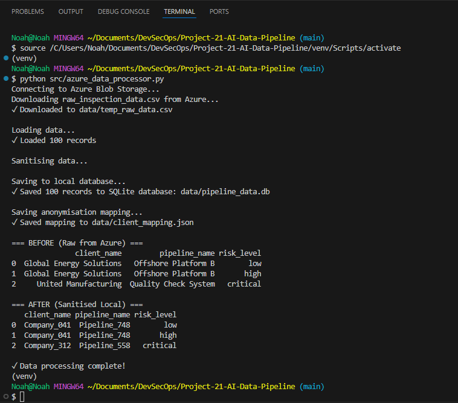
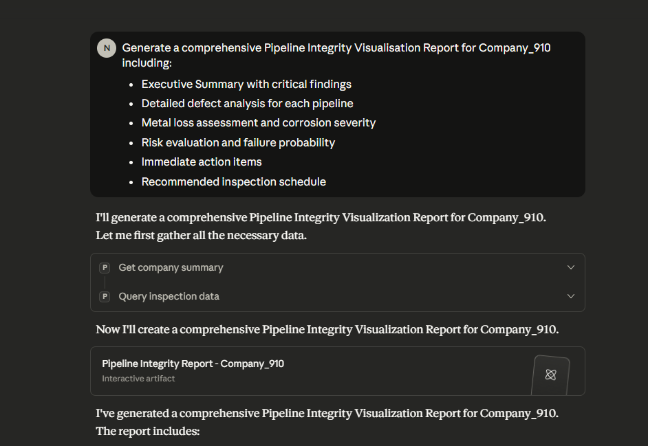
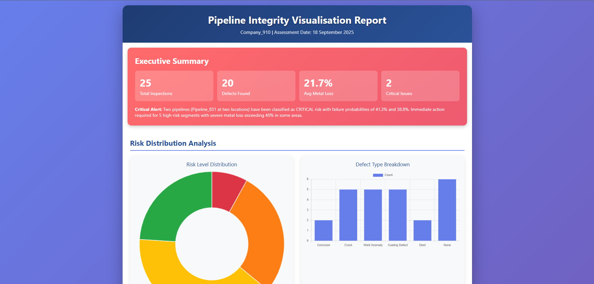

# Project 21: AI Data Pipeline

Sensitive data stored on Azure Blob. Python script downloads and sanitises data locally. Claude Desktop connects via MCP for secure AI analysis and reporting.

## Technologies

Azure Blob Storage • Python • SQLite • MCP • Claude AI • Pandas • Faker

## Screenshots

  

## Documents

[Interactive Report](https://nfroze.github.io/Project-21-AI-Data-Pipeline/report.html)